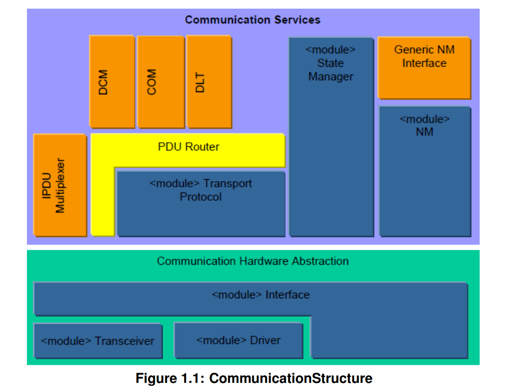
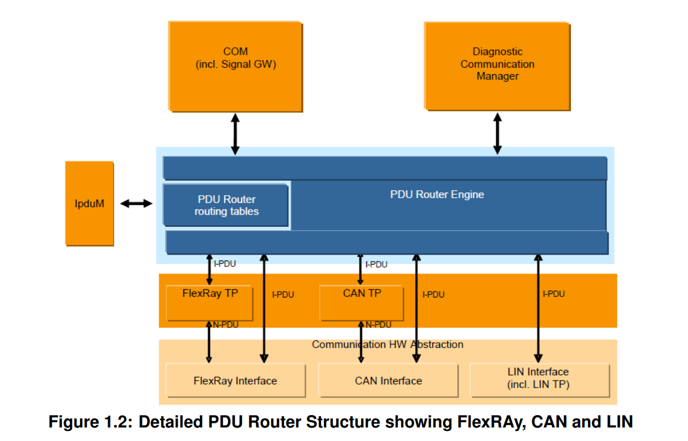
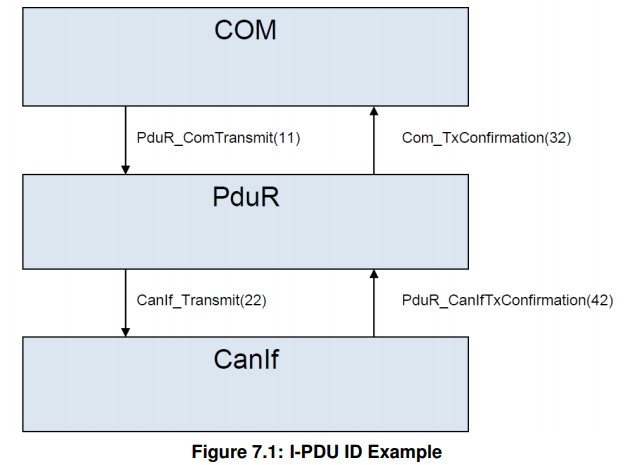
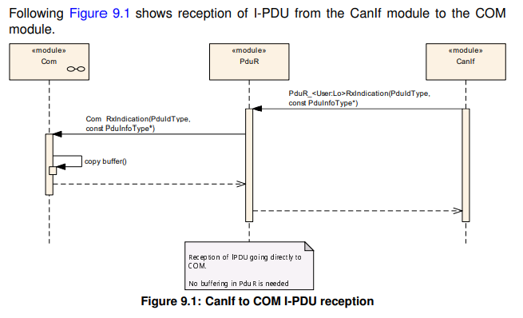
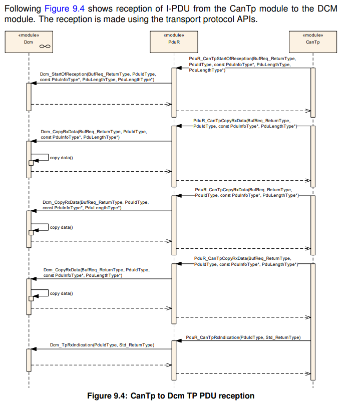
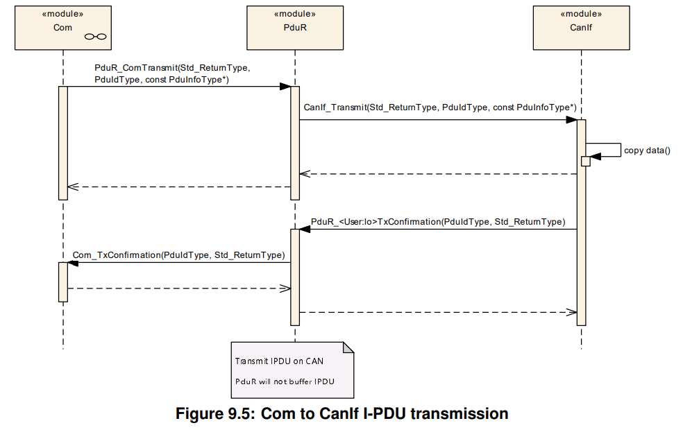
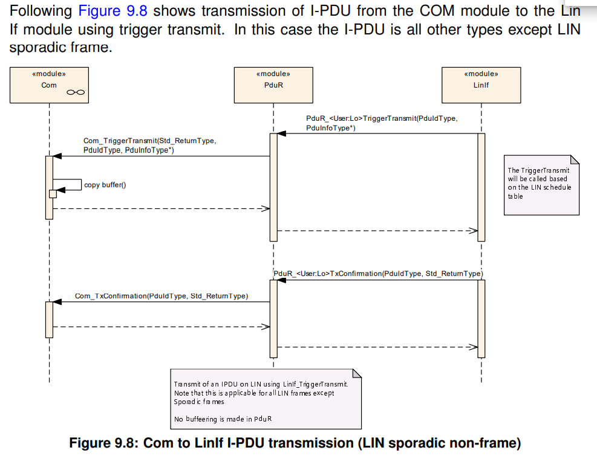
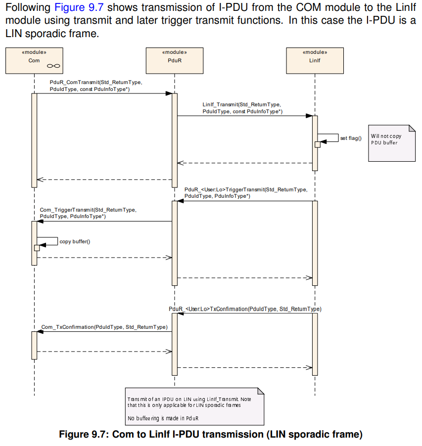
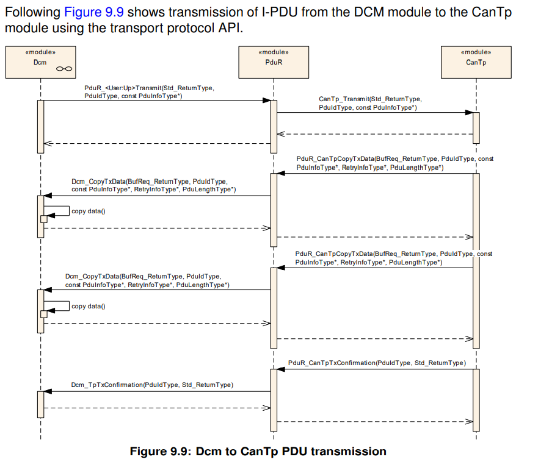
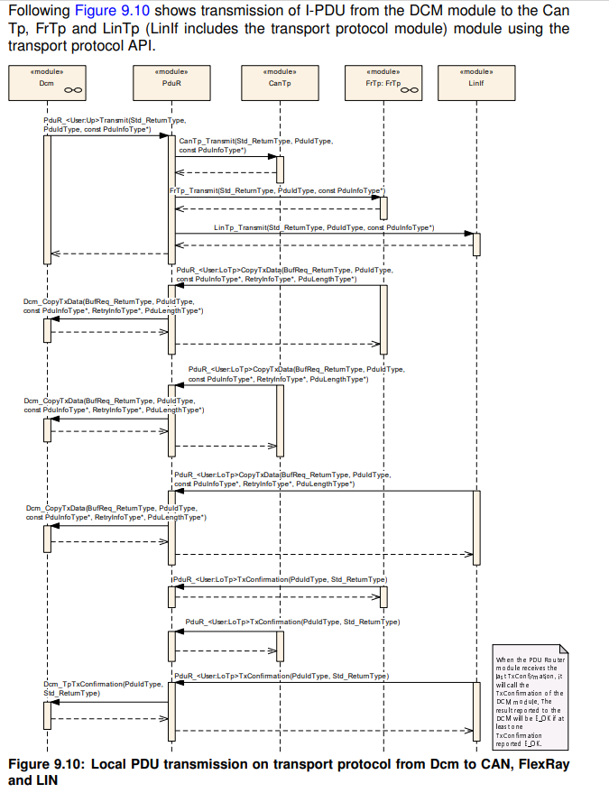

## 介绍和功能总览

PUDR模块提供路由`I-PDUs`(`Interaction Layer Protocol Data Unites`)的服务，通过以下模块类型实现：

- 通信接口模块：使用`<Provider:Up>`或`<Provider:Lo> APIs`，如`Com`，`IPduM`，`LinIf`，`CanIf`，`CanNm`等。
- 传输协议模块：使用`<Provider:UpTp>`或`<Provider:LoTp> APIs`，如`Com`，`Dcm`，`LinTp`，`CanTp`等。

`I-PDUs`的路由基于静态定义的`I-PDUs`标识符执行。没有在运行时动态的路由`I-PDUs`，如依赖`I-PDUs`的`payload`。

相关模块的位置可以是上层的，如`Com`，`IPduM`，`Dcm`，`Dlt`，也可以是下层的，如`LinIf`，`CanIf`，`LinTp`，`IPduM`，`CanNm`等。
注意`IPduM`既可以作为上层模块，也可以作为下层模块。

- 下层：在`Com`和`IPduM`模块间通信。
- 上层：在`IPduM`和更底层模块间通信。

???+ note
    这里的上下层指的是`IPduM`相对于`PUDR`所处的位置。

`PUDR`模块基于接口模块的通用方法。在`PUDR`模块配置中配置了接口模块。上一段括号中列出的模块只是示例，而不是详尽的列表。
`PUDR`可以轻松配置以支持其他上层和下层模块。这种方法还允许将复杂设备驱动程序（`CDD`）集成为`PUDR`的上层或下层模块。

`PUDR`模块的用户列表不固定。上层和下层对的最常见组合如下所示：

- `Dcm`和`Tp`模块；
- `Com`和`If`、`Tp`，`IPduM`模块；
- `IPduM`和`If`模块。

### `AutoSar`架构

`PUDR`模块是`AutoSar`通信结构中的中心模块，下图给出通信结构的总体描述。

### PDUR模块功能总览

`PUDR`模块是`AutoSar BSW`的一部分，在每个`AUTOSAR ECU`中都必须实例化。`PDUR`模块结构如下图所示：

`PUDR`模块主要有两部分组成：

- `PUDR`路由路径：静态路由路径描述了每一个`I-PDUs`被路由的属性。The routing paths can be (if supported)
updated post-build loadable in the programming state of the ECU or selected
when initializing the PDU router by post-build selectable。
- `PUDR`引擎：根据路由路径执行路由操作的实际代码。路由器引擎必须处理：
  - 将`I-PDUs`从源端路由到目的端
  - 将源`I-PDU ID`转换为目标`I-PDU ID`，例如`PduR_ComTransmit` to `CanIf_Transmit`, `PduR_CanIfTxConfirmation` to `Com_TxConfirmation`。

### `I-PDU`处理

`I-PDU`由静态`I-PDU ID`标识。 `PDUR`模块通过使用静态配置表中的`I-PDU ID`来确定`I-PDU`的目的地。 `I-PDU`用于`PDUR`模块上层模块的数据交换，例如`Com`模块和`Dcm`模块。
`PDUR`模块的路由操作不会修改`I-PDU`，它只是将`I-PDU`转发到目标模块。在`TP`网关的情况下，可以在接收到完整的`I-PDU`之前开始将`I-PDU`转发到目的地。

在配置中设置了`I-PDU ID`并实现了`API`。这样可以有效地在每个接收`I-PDU ID`的模块中实现查找表（例如，`PDUR`模块的配置包含用于`PduR_CanIfTxConfirmation`的I-PDU ID）。

`PDUR`模块可实现：

对于`NM`数据交换，PDU路由器模块被绕过。

## 缩略语

* * *

|       缩略语      |  描述 |
| :-----------: | :-----: |
|       Upper Layer Modules(Up)      |   上层模块，如`Com`，`Dcm`  |
|       Lower Layer Modules(Lo)      |   下层模块，如`CAN`，`LIN`，`ETH`通信接口模块和传输模块|
|`PDUR`                              | 将`I-PDU`从一个模块传输到另一模块的模块。 `PDUR`模块可用于网关操作和内部路由目的|
|on-the-fly gatewaying | 网关功能；在两个`TP`模块之间路由，在已接收到所有数据之前就开始了数据转发（达到指定的阈值时）。如果在两个接口之间传输大量数据，则希望能够在从源网络接收所有数据之前开始在目标网络上进行传输。这样可以节省内存和时间。|
|多播操作                             | 将`PDU`同时传输到一组接收器，即`1：n`路由。|
|data provision                              | 向接口模块提供数据。**direct data provision**: 在发送请求时直接提供要发送的数据。目标通信接口可能有两种行为，要么直接复制数据，要么将复制推迟到触发传输。**trigger transmit data provision**:在发送请求时未提供要发送的数据，但接口模块将通过回调函数获取要发送的数据。|
|last-is-best buffering                             | 最新值覆盖最后一个值的缓冲策略。|
|FIFO buffering                          | 缓冲区概念，使用先进先出策略。|
|I-PDU ID |PDU Identifier|
|I-PDU| Interaction Layer PDU. An I-PDU consists of data (buffer), length and I-PDU ID. The PDU Router will mainly route I-PDUs (exception is on-the-fly gatewaying). |
|N-PDU | Network Layer PDU. Used by Transport Protocol modules to fragment an I-PDU. |
|L-PDU | Data Link Layer PDU. One or more I-PDUs are packed into one L-PDU. The L-PDU is bus specific, e.g. CAN frame. |
|SF | Single Frame, Transport Protocol term |
|FF | First Frame, Transport Protocol term |
|CF | Consecutive Frame, Transport Protocol term PDU Protocol Data Unit |
|BSW | Basic Software |
|`<SrcLo>` | Lower layer communication interface module acting as a source of the I-PDU. The SrcLo is always one. |
|`<DstLo>` | Lower layer communication interface module acting as a destination of the I-PDU. The DstLo may by one to many. |
|`<SrcLoTp>` | Lower layer Transport Protocol module acting as a source of the I-PDU. The SrcLoTp is always one. |
|`<DstLoTp>` | Lower layer Transport Protocol module acting as a destination of the I-PDU. The DstLoTp may by one to many |
| `<Lo>` |Lower layer communication interface module |
| `<Up>` |Upper layer module |
| `<LoTp>` |Lower layer Transport Protocol module |
| `<module>` |Any type of module <...> |

## 约束和假设

### 限制条件
PDUR 模块不支持以下功能：

- 信号提取或转换
- 数据完整性检查，如checksums
- 改变或修改 I-PDU
- 做出任何与PDU payload相关的路由决策
- 在TP模块和IF模块之间的路由，反之亦然
- 在通信接口模块之间路由I-PDU并支持速率转换，这个功能通常由上层模块支持，如COM。

#### 已支持功能的限制条件

PDUR模块支持从本地模块（例如Com模块）传输的I-PDU的fan-out。如果将I-PDU传输到多个目的地有一些限制，(如 fan-out $1:n; n>1$),因为上层模块不知道有多少个目的地。

- 如果至少一个目标下层报告E_OK，则PDUR会报告来自上层的传输请求为E_OK。
- PDUR从目的地低层接收到最后的传输确认时，便会向高层发送传输确认。
- PDUR仅在所有目标较低层都返回E_OK的情况下，才返回E_OK进行上级请求的传输取消。

如果I-PDU fan-out由PDUR执行，则对于作为上层模块的Com会有进一步的影响：

- Update bits将不在有效
- I-PDU序列计数器将不在有效
- 通信接口API的Tx确认将如下方式处理，当最后一个目的地传输确认后，将通知本地模块（例如Com模块）。这意味着针对最后一个Tx确认进行了deadline monitoring（即，所有I-PDU是否成功传输都没有区别）。
- I-PDU组的启动和停止会影响所有目的地

???+ note
    请注意，上述限制未设置为要求，因为它们与PduR模块提供的功能无关。但是使用PduR模块的含义将影响这些功能。

## 7 功能描述

PDUR模块是一个I-PDU传输单元，位于接口模块和传输协议模块（下层模块）上方以及Com和Dcm（上层模块）下方。

IPDUM支持I-PDU的多路复用。当IPDUM调用PDUR模块以传输多路复用I-PDU时或当IPDUM被PDUR模块调用以接收多路复用I-PDU或发送确认或通过trigger tansmit提供数据时，作为上层模块。如果IpduM调用PDUR模块以将传输确认或接收指示转发到上层（例如Com），或者被PDUR模块调用以更新属于复用I-PDU的I-PDU，必须被视为较低层的模块。

从ECU的角度来看，PDUR模块可以执行三种不同类型的操作:

- 接收PDU给本地模块：从下层模块接收I-PDU，并将它们转发到一个或多个上层模块
- 本地模块发送PDU：根据上层模块的请求将I-PDU发送到一个或多个下层模块
- PDU网关：
  1.  从接口模块接收I-PDU，并通过相同或其他通信接口模块立即发送I-PDU；
  2.  从传输协议模块接收I-PDU，并通过相同或其他传输协议模块传输I-PDU。

允许组合使用PDU接收和PDU网关。例如，Com模块接收I-PDU的同时，I-PDU将被路由到其他底层模块。

???+ note
    当PduR检测到开发，运行时或瞬时错误时，在调用Default Error Tracer模块时，它将使用调用模块的模块ID作为实例ID。

### 7.1 I-PDU处理

> **[SWS_PduR_00160]**：PDUR模块应以一致的方式从源模块向目标模块传输未经修改的I-PDU。

I-PDU通过I-PDU ID或符号名(I-PDU container的符号名)进行标识。对于post-build，需要I-PDU ID，因为必须在编译PDUR模块后识别I-PDU。如果PDU路由器模块是pre-compile的（即在源代码中），则可以使用符号名。

每个处理I-PDU并为I-PDU提供API的BSW模块都必须包含I-PDU ID列表。这意味着每个被调用模块都将具有一个标识I-PDU的查找表。

例如：Com模块调用 `PduR_ComTransmit`(这里PDUR模块将会列出I-PDU ID)，PDUR将会调用`CanIf_Transmit`(这里CanIf模块将会列出I-PDU ID)，CanIf模块将调用`PduR_CanIfTxConfirmation`(这里PDUR模块将会列出I-PDU ID),
PDUR模块将调用`Com_TxConfirmation`(这里Com模块将会列出I-PDU ID)，实例如下图所示，其中I-PDU ID是调用接口的参数。

> **[SWS_PduR_00161]**：PDUR模块应通过源模块I-PDU ID（位于PDU路由器配置中）和目标I-PDU ID（位于被叫目标模块配置中）的组合唯一地标识路由路径。

> **[SWS_PduR_00766]**：PDUR模块应将I-PDU ID转换为目的地模块的ID，以进行传输路径和确认路径。

示例：Com模块将I-PDU传输到CanIf和LinIf。调用`PduR_ComTransmit`发送。 PDUR模块会将源I-PDU ID（PDU路由器模块配置）转换为LinIf（LinIf模块配置）的一个I-PDU ID和CanIf（CanIf模块配置）的一个I-PDU ID。
从Com模块接收到的PduInfoType值将被复制到CanIf和LinIf模块，而无需进行任何更改。

示例：LinIf将使用I-PDU ID调用`PduR_LinIfTxConfirmation`，并取决于传输成功与否，并返回结果E_OK（成功传输）或E_NOT_OK（传输失败）。然后，PDUR模块将转换此I-PDU ID，并使用`Com_TxConfirmation`将转换后的I-PDU ID和收到的结果转发到Com。

> **[SWS_PduR_00162]**：PDUR模块只能根据配置中给定的路由路径来路由I-PDUs。

> **[SWS_PduR_00828]**：PduR生成器（验证）应拒绝通过路由路径连接具有不同MetaDataTypes的I-PDUs的配置。

####  7.1.1 接收I-PDU给上层模块

PDUR模块的接收操作始终由来自下层模块（通信接口模块或传输协议模块）的指示（`PduR_<User:Lo>RxIndication`或`PduR_<User:LoTp>RxIndication`）完成。指示功能由下层在通信驱动程序的周期函数的上下文中或在中断的上下文中执行。

##### 7.1.1.1 通信接口

源通信接口模块通过调用`PduR_<User:Lo>RxIndication`指示接收到的I-PDU。 I-PDU可能具有路由路径所配置的多个目标本地模块。

> **[SWS_PduR_00164]**：PduR模块应通过I-PDU的1:n路由，从通信接口模块路由到一个或多个上层模块。

例如，I-PDU从CanIf接收并转发给Com。

???+ note
    I-PDU可被一个或多个上层模块同时接收，或路由到一个或多个通信接口。

> **[SWS_PduR_00621]**：当`PduR_<User:Lo>RxIndication`被调用时，PDUR应调用`<Up>_RxIndication`，应通知每一个目标上层模块。

> **[SWS_PduR_00744]**：如果本地模块接收到I-PDU，PDUR模块不应检查I-PDU的长度，仅仅转发indication给上层模块。

由于PDUR模块不会缓冲此I-PDU，因此它不必拒绝长于或短于配置的I-PDU。

##### 7.1.1.2 传输协议

对于传输协议模块，当接收到首帧FF或单帧SF时，PDUR模块首先被通知开始接收提醒。通过调用`<Up_StartOfReception>`提醒上层模块。通过后续的`<Lo>_CopyRxData`调用将payload的每一个片段(NPDU)copy到目的上层模块。
接收到最后一个N-PDU后，传输协议模块会通知PDUR模块，完整的I-PDU已经被接收，PDUR模块将会通过调用`<Up>_TpRxIndication`转发这个通知给相关的上层模块。

通过传输协议模块接收I-PDU只有一个由路由路径配置的上层模块。

> **[SWS_PduR_00673]**：PDUR模块应为从源传输协议模块接收并路由到一个目标上层模块的I-PDU提供1：1路由。

示例：从CanTp模块接收功能寻址请求（在SF中），并将其路由到Dcm模块。

> **[SWS_PduR_00549]**：当源传输协议模块指示仅有上层模块为目的地的PDU的开始接收时，通过`PduR_<User:LoTp>StartOfReception`指明，PDUR模块应当通过调用`<Up>_StartOfReception`，转发该请求给上层目的模块。

> **[SWS_PduR_00623]**：PDUR模块应当转发`<Up>_StartOfReception`的返回值给源传输协议模块。

> **[SWS_PduR_00428]**：当源传输协议模块请求PDUR模块使用`PduR_<User:LoTp>CopyRxData`复制接收到的数据时，PDUR模块应通过调用`<Up>_CopyRxData`将请求转发到目标上层模块。

> **[SWS_PduR_00429]**：当源传输协议模块调用`PduR_<User-LoTp>RxIndication`指示接收到完整的I-PDU时，PDUR模块应通过调用`<Up>_TpRxIndication`将指示转发到目标上层模块。

> **[SWS_PduR_00207]**：如果源传输协议模块使用`PduR_<UserLoTp>RxIndication`报告错误，则PDUR模块除将指示转发到上层模块外不应执行任何错误处理。

###### 7.1.1.2.1 处理未知长度的I-PDU

PduR能够使用TP API处理未知长度的I-PDU（即数据流类型）。未知长度的定义由`TpSduLength = 0`表示。

> 在本地接收的场景中，`PduR_<User:LoTp>StartOfReception`被带`TpSduLength = 0`参数调用，PDUR应当带`TpSduLength = 0`参数调用`<Up>_StartOfReception`。

#### 7.1.2 从上层模块发送I-PDU

向底层目的模块的发送操作总是异步的。这意味着当I-PDU被PDUR模块传递给底层目的模块后，发送服务请求立即返回。如果底层目的模块通过`PduR_<User:Lo>TxConfirmation`(通信接口)或`PduR_<User:LoTp>TxConfirmation`(传输协议)通知PDUR模块，传输成功或失败。
PDUR模块应当转发这个指示给上层模块通过`<Up>_TxConfirmation`或`<Up>_TpTxConfirmation`。

PDUR模块的发送操作由来自源上层源模块的PDU发送请求触发，并将请求转发到目标下层模块。

> **[SWS_PduR_00629]**：如果来自源高层模块的PDU传输，则I-PDU不得在PDUR模块中进行缓冲。

##### 7.1.2.1 多播

多播功能分为一个单独的部分，因为使用此功能存在一些问题，如第4.1.1节中所述。 PDUR模块直接处理的其他需求：
> **[SWS_PduR_00218]**：如果提供的I-PDU ID代表一组PDU（多播传输请求），并且转发的传输请求中至少有一个返回成功，则功能`PduR_<Up>Transmit`将返回`E_OK`。

请注意，以`E_OK`    返回的通信接口将直接(directly)或通过触发传输(trigger transmit)来传输其数据。

其他传输协议模块可能返回`E_NOT_OK`，因此这些模块不会调用`PduR_<User:LoTp>CopyRxData`。因为源上层模块已经被通知至少一个传输请求已经成功，至少一个传输协议模块将会调用`PduR_<User:LoTp>CopyRxData`。

> **[SWS_PduR_00633]**：如果有多个底层目的模块的传输请求，则所有模块必须只能全为通信接口模块或传输协议模块，而不是他们的混合。

例如：以上要求基本上意味着Com模块无法请求传输，然后PDUR模块使用相同的I-PDU将传输路由到CanTp模块和CanIf模块。

> **[SWS_PduR_00589]**：在多播通信接口传输情况下，支持发送确认的通信接口模块收到最后一个发送确认后，PDUR模块应当调用上层模块的发送确认API。

???+ note
    如果并非所有目的地都提供Tx确认，则上述需求也适用。

当源模块请求传输并且PduR将进行多播时，请求和多播中的所有I-PDU都将具有不同的I-PDU ID。因此，PduR必须记住传输请求中的I-PDU ID，以便可以正确确认传输。

##### 7.1.2.2 通信接口

I-PDU可以通过三种方式在通信接口上传输：

1. Direct data provision：上层模块调用`PduR_<User:Up>Transmit`后，PDUR模块进一步调用`<Lo>_Transmit`，数据被底层通信接口模块拷贝。

2. Trigger transmit provision：当底层模块调用`PduR_<User:Lo>TriggerTransmit`请求传输I-PDU时，PDUR模块进一步调用`<Up>_TriggerTransmit`，数据被上层模块拷贝。

3. 上层模块调用`PduR_<User:Up>Transmit`后，PDUR模块进一步调用`<Lo>_Transmit`，但数据没有被底层模块拷贝，而是当底层调用`PduR_<User:Lo>TriggerTransmit`时请求到数据。

I-PDU的传输确认，对于直接和触发传输数据的规定是相同的。

> **[SWS_PduR_00627]**：当通信接口模块调用`PduR_<User:Lo>TxConfirmation`后，PDUR模块应当调用上层模块的`<Up>_TxConfirmation`，并从下层转发传输结果给上层。
> **[SWS_PduR_00745]**：如果I-PDU被上层模块发送，PDUR模块不应该检查I-PDU的长度。
> **[SWS_PduR_00625]**：当源上层模块调用`PduR_<User:Up>Transmit`，PDUR应当调用每一路目的通信接口模块的`<Lo>_Transmit`。
> **[SWS_PduR_00626]**：如果单播，`<Lo>_Transmit`的返回值应当转发给源上层模块。

###### 7.1.2.2.1 Trigger transmit data provision

必须通知上层模块是否必须重置更新位并以适当的方式处理I-PDU计数器。

> **[SWS_PduR_00430]**：PDUR模块应当转发通信接口模块的`PduR_<User:Lo>TriggerTransmit`请求给上层模块，通过调用`<Up>_TriggerTransmit`实现。
> **[SWS_PduR_00661]**：PDUR模块应当拷贝`<Up>_TriggerTransmit`的返回值给下层模块。

###### 7.1.2.2.2 错误处理

对于在通信接口模块上使用单播或多播发生的错误，不会进行特定的错误处理。返回值中的错误将转发到源上层模块。

##### 7.1.2.3 传输协议

使用传输协议传输I-PDU具有两种形式，即单播和多播。单播（1：1）传输由一个源上层模块和一个目标下层传输协议模块组成。多播（1：n，n> 1）传输由多个目标低层传输协议模块组成。
PDU路由器模块将不会检查传输请求是否包含单个N-PDU（SF）或多个N-PDU（FF，CF，...）。

通过上层源模块的`PduR_<User:Up>Transmit`请求发起I-PDU的传输。 PduR将根据路由路径使用`<Lo>_Transmit`将请求转发到一个或多个目标较低层传输协议模块。请注意，`<Lo> _Transmit`可能包含或可能不包含数据。

目标模块将通过调用`PduR_<User:LoTp>CopyTxData`请求数据。通过`RetryInfoType`参数进行数据的重新传输（如果传输协议支持）。完成传输目标模块后调用`PduR_<User:LoTp>TxConfirmation`，转发到源上层模块。

> **[SWS_PduR_00634]**：当上层模块调用`PduR_<User:Up>Transmit`时，PDUR模块应当调用每一路目的传输协议模块的`<LoTp>_Transmit`。
> **[SWS_PduR_00299]**：当目的传输协议模块调用`PduR_<User:LoTp>CopyTxData`时，PDUR模块应当调用源上层模块的`<Up>_CopyTxData`。
> **[SWS_PduR_00676]**：`<Up>_CopyTxData`的返回值应当转发给目的底层传输协议模块。
> **[SWS_PduR_00301]**：对于单播，PUDR模块应当转发底层传输协议模块的`PduR_<User:LoTp>TxConfirmation`给上层模块，通过`<Up>_TpTxConfirmation`。
> **[SWS_PduR_00432]**：对于单播，当调用`<Lo>_Transmit`后，PDUR模块应当返回相同的返回值给源上层模块调用的`PduR_<User:Up>Transmit`。

###### 7.1.2.3.1 多播发送

本小节包含使用传输协议模块对I-PDU进行多播传输的特定要求。由于在PDUR模块中进行了1：n，n> 1路由，因此PDU路由器模块必须多次向源上层模块请求相同的数据。另外，必须特别处理多播的确认。

由于上层将多次复制同一数据，因此PDUR将使用`RetryInfoPtr`多次查询同一数据`RetryInfoPtr`包含一个称为`TpDataState`的状态类型。

> **[SWS_PduR_00631]**：传输过程中，第一个目的底层模块的`PduR_<User:LoTp>CopyTxData`请求应当带参数`TpDataState=TP_CONFPENDING`转发。
> **[SWS_PduR_00632]**：接下来的`PduR_<User:LoTp>CopyTxData`请求应当带参数`TP_DATARETRY`转发，为了相同的数据拷贝。
> **[SWS_PduR_00812]**：在所有传输协议接收到它们的数据之后，PDUR模块可以向上层模块发送确认数据。
> **[SWS_PduR_00765]**：对于多播传输，则在从下层传输协议模块接收到最后一个`PduR_<User:LoTp>TxConfirmation`后，PDUR模块应使用`<Up>_TpTxConfirmation`通知上层模块。如果至少一个`PduR_<User:LoTp>TxConfirmation`报告了`E_OK`，则结果参数应为`E_OK`。

###### 7.1.2.3.2 错误处理

PDUR模块将不会对发生的错误采取特定的措施，这些错误将转发到源上层模块。上层模块负责适当的错误处理。

###### 7.1.2.3.3 处理未知长度的I-PDU

PduR能够使用TP API处理未知长度的I-PDU（即数据流类型）。未知长度的定义由`TpSduLength = 0`表示。

> **[SWS_PduR_00822]**：本地传输场景中，`PduR_<User:Up>Transmit`带参数`PduInfoType.SduLength=0`被调用，I-PDU被路由到TP模块，PDUR应当带参数`PduInfoType.SduLength=0`调用所有TP模块的`<LoTp>_Transmit`。

#### 7.1.3 I-PDU网关

PDUR模块支持I-PDU从一个源总线到一个或多个目标总线的网关。与从/向本地模块进行发送和接收的区别在于，PDU路由器模块必须同时是接收器和发送器，并且在某些情况下还为I-PDU提供缓冲。

特意隔离网关要求，以在不需要网关的情况下有效实现PDUR模块。如果PDUR模块允许I-PDU的网关，则这些要求被视为附加要求，而不是替代以前的要求。

下面的列表给出网关的特征总览：

- I-PDU可以从源通信接口模块网关到一个（1：1）或多个目标通信接口模块（1：n I-PDU网关）
    - 对于每一个目的地，PDUR模块可通过可配置深度，缓存每一路的I-PDU(例如FIFO)
    - 一个I-PDU可能在被上层模块接受的同时，被网关到n个目的通信接口模块。
- 通过TP传输的I-PDU可能被网关到一个或多个目的TP模块。
    - 单帧或多帧可能被网关到多个目的TP模块或本地模块(如DCM)
    - 多个N-PDU组成的I-PDU可能通过"on-the-fly gatewaying"的方式被网关到目的地，这意味着在开始传输之前不需要接收到完整的I-PDU。
    - 多个N-PDU组成的I-PDU可能被网关到其他的TP模块或本地模块，但两者不能同时具备。
    - 通过TP模块传输的I-PDU可能被FIFO缓存。这适用于单帧和多帧。
- I-PDU只能仅在TP模块或If模块间路由，而不能混合路由，如，通过CanIf接收到的I-PDU不能被网关到LinTp。

PDUR模块应当将从一个底层模块(源网络)接收到的I-PDU转发到另一个底层模块(目标网络)，该I-PDU通过ID标识。

> **[SWS_PduR_00638]**：I-PDU只能被网关到其他的TP模块或本地模块，但两者不能同时具备。
> **[SWS_PduR_00825]**：
> **[SWS_PduR_00826]**：
> **[SWS_PduR_00827]**：
> **[SWS_PduR_00829]**：

##### 7.1.3.1 通信接口模块

###### 7.1.3.1.1 错误处理

##### 7.1.3.2 传输协议

###### 7.1.3.2.1 缓冲区分配

###### 7.1.3.2.2 直接网关

###### 7.1.3.2.3 转发给上层模块

###### 7.1.3.2.4 Gatewaying on-the-fly

###### 7.1.3.2.5 共同要求

###### 7.1.3.2.6 错误处理

###### 7.1.3.2.7 处理未知长度的I-PDU

##### 7.1.3.3 FIFO

###### 7.1.3.3.1 通信接口

###### 7.1.3.3.2 传输协议

###### 7.1.3.3.3 错误处理

### 7.2 取消发送

### 7.3 取消接收

### 7.4 Zero Cost Operation

### 7.5 状态管理

### 7.6 Routing path groups

### 7.7 Complex Driver Interaction