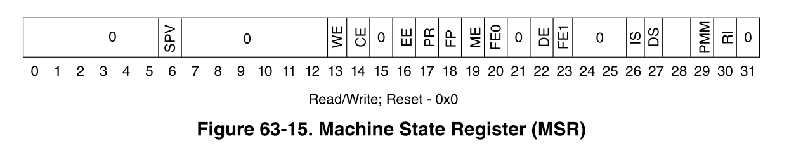
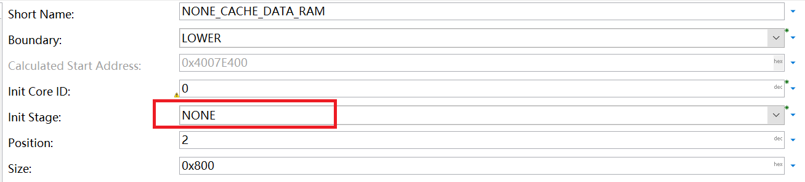
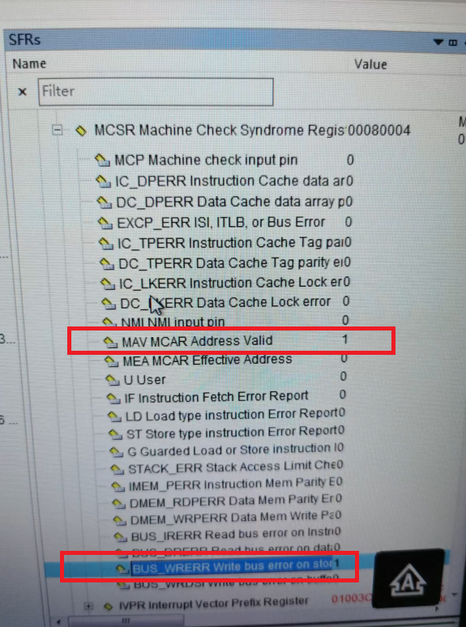

## ECC错误分析

MCU内部SRAM的值在复位后是随机的，因此，数据和校验位可能包含任意值。很可能对任何地址的第一次读取尝试都会产生不可纠正的 ECC 错误。因此 SRAM 必须在上电后初始化。通常通过对SRAM批量写值实现，而写操作必须为4字节或8字节方式，从而将ECC定义完成。否则，较小大小的写入访问会导致读取-修改-写入，并出现另一个 ECC 错误。

### 基于IVOR1的异常处理
在e200内核中，IVOR1(machine check)异常处理可以表征多位ECC错误。当MSR[ME]=1时，machine check相关的异常可内核捕获。

### 相关寄存器
以下几个寄存器可用于详细分析异常出现时的场景。

#### Machine State Register (MSR)
MSR寄存器保存了处理器的状态。e200z4204n3 MSR寄存器各位如下图所示：



- bit6 SPV: Signal Processing Extension Unit 使能位，置位时处理器可执行SPE APU vector instructions。对于e200z4204n3内核，硬件上不支持该单元，如果尝试执行相关指令，则产生非法指令异常。
- bit16 EE:外部中断使能位，该中断统一处理所有的内部外设中断。
- bit19 ME:机器检查异常使能位。

#### Machine Check Syndrome Register (MCSR)
MCSR寄存器可以区分不同机器检查异常的来源。异常服务处理函数应当分析异常的根本原因。

- 读取 ECC 损坏的数据集引起的错误，置位MCSR[MAV, LD, BUS_DRERR]
- 写入受 ECC 多位错误影响的区域引起的错误，置位MCSR[MAV, LD, BUS_DRERR, BUS_WRERR]
- 尝试执行受 ECC 多位错误集影响的指令导致的错误， 置位MCSR[MAV, IF, BUS_IRERR]
- cache行填充引起的错误（当该行内有受ECC多位错误影响的数据时）置位MCSR[MAV, BUS_DRERR]或MCSR[MAV, BUS_IRERR]

MCSR[MAV] 指明了MCAR寄存器中的地址是否被硬件更新。当该位被显式地写1清零后，下一次的地址更新才能继续。

#### Machine Check Address Register (MCAR)

当MCSR[MEA]=1时， MCAR寄存器的值有效地址。当MCSR[MEA]=0时， MCAR寄存器的值为物理地址。这些地址标明当机器检查异常发生时的位置。

在异常发生前，将MCSR[MAV]清零，MCAR的地址值才有效。

#### Machine Check Save/Restore Register 0 (MCSRR0)
该寄存器保存了导致异常时的指令地址，在异常处理结束时，rfmci指令将该寄存器的值作为返回值(PC指针)。

#### Machine Check Save/Restore Register 1 (MCSRR1)
该寄存器保存了导致异常时的MSR寄存器值。

### 异常处理函数实现
异常向量表及其内容实现在`Os_Hal_Entry_Lcfg.c`中，内容如下所示，一共定义了12个异常处理handle。

```c
#define OS_START_SEC_EXCVEC_CORE0_CODE
#include "Os_MemMap_OsSections.h"

OS_HAL_CODE_SECTION(OS_EXCVEC_CORE0_CODE)
Os_Hal_Asm("   .globl OS_EXCVEC_CORE0_CODE"); 
Os_Hal_Asm("OS_EXCVEC_CORE0_CODE:"); 
Os_Hal_CoreException(Os_Hal_Exception_Unhandled_0)  
Os_Hal_CoreException(Os_Hal_Exception_MachineCheck_MCSRR)
Os_Hal_CoreException(Os_Hal_Exception_Data)  
Os_Hal_CoreException(Os_Hal_Exception_Instruction)  
Os_Hal_CoreException(Os_Hal_Exception_ExternalInterrupt)  
Os_Hal_CoreException(Os_Hal_Exception_Unhandled_5)  
Os_Hal_CoreException(Os_Hal_Exception_Program) 
Os_Hal_CoreException(Os_Hal_Exception_Unhandled_7)  
Os_Hal_CoreException(Os_Hal_Exception_Trap) 
Os_Hal_CoreException(Os_Hal_Exception_Unhandled_9)  
Os_Hal_CoreException(Os_Hal_Exception_Unhandled_10) 
Os_Hal_CoreException(Os_Hal_Exception_Unhandled_11) 

#define OS_STOP_SEC_EXCVEC_CORE0_CODE
#include "Os_MemMap_OsSections.h" /* PRQA S 5087 */ /* MD_MSR_MemMap */

```

异常处理函数的实现在`Os_Hal_Core.c`中，其中`Os_Hal_Exception_MachineCheck_MCSRR`如下：

```c

OS_HAL_OS_CODE_SECTION()
OS_HAL_BYTE_ALIGN_4;  
Os_Hal_Asm(" .globl Os_Hal_Exception_MachineCheck_MCSRR");  
Os_Hal_Asm("Os_Hal_Exception_MachineCheck_MCSRR:"); 
Os_Hal_Exception_Save_Context_Asm() // 保存异常时程序运行的上下文在全局变量OsCfg_Hal_Context_OsCore0_ExceptionContext中
Os_Hal_Exception_Save_MCSRR_Asm() // Save MCSRR0 and MCSRR1 in Pc and Msr 
Os_Hal_Exception_Clear_MCSR()  
Os_Hal_Exception_Memory_Handler_Asm()  //调用Os_Hal_Exception_Memory_Handler
Os_Hal_Exception_Resume_Context_Asm()  //异常处理结束，恢复上下文
```

`Os_Hal_Exception_Memory_Handler`处理函数在`Os_Hal_Entry.c`中。

### ME异常实例


如上图所示，在vlinkgen模块中配置特殊的RAM块时，错误的没有选择该块的初始化阶段，则该块默认不初始化。

后续分配在该块的var group，在启动代码的初始化阶段时，由于读取-修改-写入操作，产生了ECC错误，但由于MSR寄存器的ME使能位未置位，出现异常时，并不会立即出发异常处理。

以上操作在`BrsMainStartup.c`文件的`Brs_PreMainStartup`函数中的`Brs_MemoryInit(&vLinkGen_Init_One_GroupsSet, coreID)`这一步操作。

所以通过调试器，在该步骤运行后，查看相关寄存器，如MCSR，MCSRR0，MCSRR1寄存器。这些寄存器有出现异常时的标志信息和导致异常的ram地址信息。具体值如下：



`Os_Hal_Core.c`文件的`Os_Hal_CoreInit`函数中，会通过`Os_Hal_WriteMSR`写MSR寄存器，之后马上触发异常处理。

