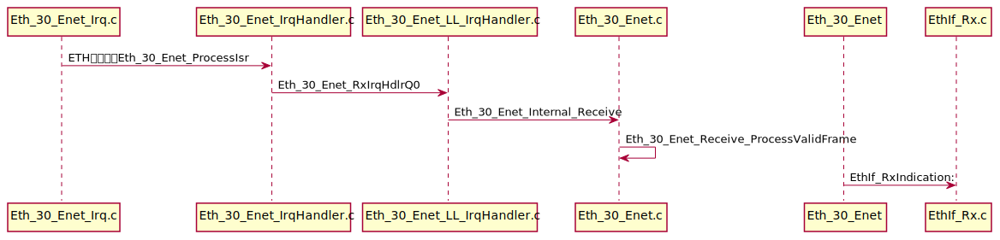

## ENET中断分析

ENET 由中断触发到上层数据接收并处理的过程见下图。



其中`Eth_30_Enet_Irq.c`中包含`OS`中配置的`ENET`中断处理函数：

```c
ISR( EthIsr_EthernetCnt_MCU_Ctrl_ad7672f0_EthInterruptServiceRoutine_Q0Rx );
ISR( EthIsr_EthernetCnt_MCU_Ctrl_ad7672f0_EthInterruptServiceRoutine_Q0Tx );
```

后续通过`Eth_30_Enet_Internal_Receive`处理接收到的数据帧，其中由`Eth_30_Enet_Receive_ProcessValidFrame`验证数据帧后，由`EthIf_RxIndication`传至上层模块。

