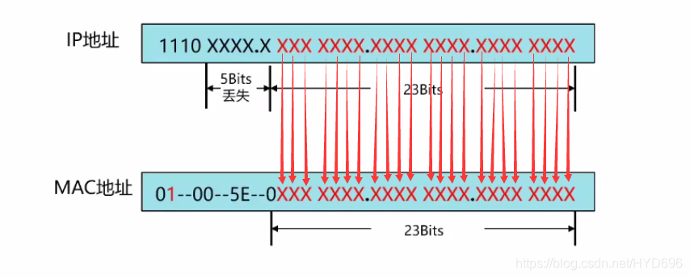
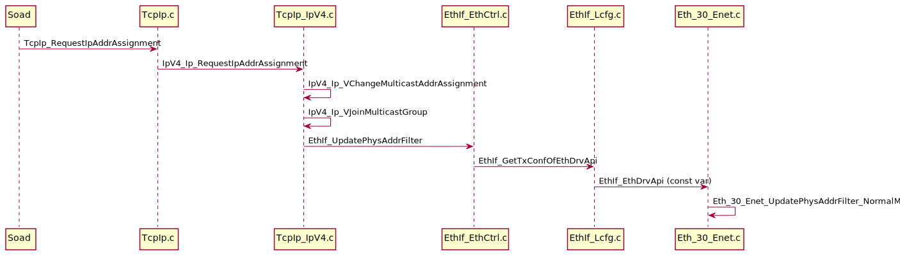

## 组播地址

组播报文的目的地址使用D类IP地址， D类地址不能出现在IP报文的源IP地址字段。
单播数据传输过程中，一个数据包传输的路径是从源地址路由到目的地址，利用“逐跳”的原理在IP网络中传输。
然而在ip组播环中，数据包的目的地址不是一个，而是一组，形成组地址。
所有的信息接收者都加入到一个组内，并且一旦加入之后，流向组地址的数据立即开始向接收者传输，组中的所有成员都能接收到数据包。
组播组中的成员是动态的，主机可以在任何时刻加入和离开组播组。

## 范围

- 224.0.0.0～224.0.0.255为预留的组播地址（永久组地址），地址224.0.0.0保留不做分配，其它地址供路由协议使用；
- 224.0.1.0～224.0.1.255是公用组播地址，可以用于Internet；
- 224.0.2.0～238.255.255.255为用户可用的组播地址（临时组地址），全网范围内有效；
- 239.0.0.0～239.255.255.255为**本地**管理组播地址，仅在特定的本地范围内有效。

## 组播IP地址和MAC地址转换

组播MAC地址有IP地址映射转换而成，过程如下图所示：

过程如下：

1. 加上MAC地址固定前缀（24bit）为：01-00-5E；
2. 后面24bit由IP地址的后23bit构成；
3. 第25 bit位固定为0；

### 举例

以Someip SD服务组播地址为例，组播IP地址为`239.127.3.1`。

- 二进制: `1110 1111 0111 1111 0000 0011 0000 0001`
- 固定前缀: `01-00-5E-` + `0b`
- 转换结果: `01-00-5e-7f-03-01`

## 代码

协议栈中由TCPIP模块分配多播IP地址到设置`ENET multicast mac filter ENETn_GAUR/GALR`寄存器的过程如下图所示：

